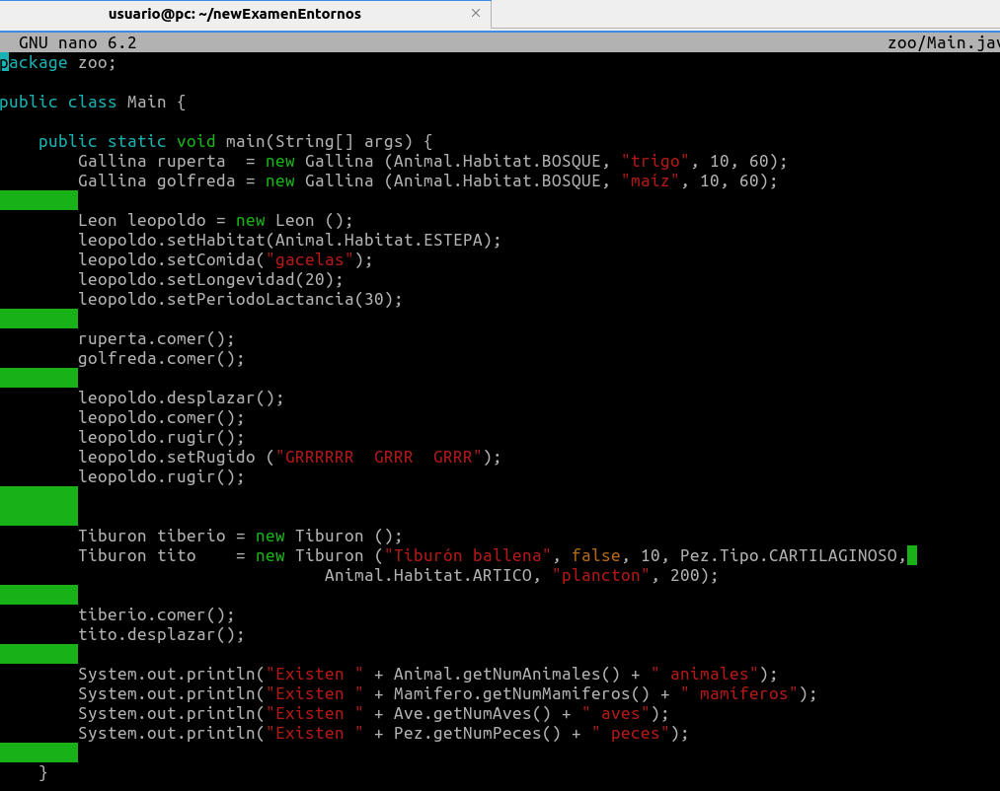

# Actividad 1:

1. Ejecuta el programa "Hola mundo" en los siguientes lenguajes:
 

 
 
 

 - bash:
    
Script: 

    #!/usr/bin/env bash 
    echo "Hola mundo"

 - python:
  
Script: 

    #!/usr/bin/env python3 
    print ("Hola mundo")

 - php:
    
Script: 

    #!/usr/bin/env php

    <?php 
    echo "Hola mundo\n" 
    ?>

 - javascript (nodejs)
    
Script: 

    #!/usr/bin/env node

    console.log('Hola mundo');

 - c
    
Script: 

    #include <stdio.h>

    int main() {
        printf("¡Hola mundo!");
        return 0;
    }

* No entiendo porque no funciona
  

 - c++
    
Script: 

    #include <iostream>

    using namespace std;

    int main()
    {
    cout << "¡Hola, mundo!" << endl;
    return 0;
    }

 - java
    
Script:  La clase del archivo hola.java es Hola

    class Hola
    {
        public static void main(String[] args)
        {
            System.out.println("Hola Mundo");
        }
    }

 - ruby
    
Script: 

    #!/usr/bin/env ruby

    puts "Hola Mundo"

 - go 
  
Script:

        package main

        import "fmt"

        func main() {
                fmt.Println("Hola mundo desde Go")
        }

 - rust

Script: 

        fn main() {
            println!("¡Hola, mundo! Desde RUST ");
        }

 - lisp
 
Script: 

    #!/usr/bin/env clisp

    (format t "¡Hola, mundo!")

 - ensamblador (nasm)
  
Script: 

    section .data
    
    msg     db "¡Hola Mundo!", 0Ah
    len     equ     $ - msg  
    
    section .text
    
    global _start
    
    _start:
            mov     eax, 04h
            mov     ebx, 01h
            mov     ecx, msg
            mov     edx, len
            int     80h
            mov     eax, 01h
            mov     ebx, 00h
            int     80h

  
  

 # Actividad 2:

 

2. Compila y ejecuta el código proporcionado usando únicamente el compilador, el
intérprete y el empaquetador de terminal para Java.

 
 
Vamos a compilar y ejecutar el codigo, primero nos situamos fuera de la carpeta de los archivos que queremos compilar, luego hacemos un ls de la carpeta para ver todos los archivos y utilizamos un path para compilar todos a la vez, este es 
"javac paquete/*.java", luego queremos ejecutar el archivo que contenga el main, en este caso es el Main.class por lo que utilizamos "java paquete.Main", esto nos ejecutara todo el main

 
 
Aqui tenemos el main con su paquete como se ve, y con todas las cosas que va a monstrar por pantalla cunado se ejecute.

 
Aqui la compilacion de todos los archivos a la vez, y la ejecucion de  estos:

 
Ahora procedemos a empaquetar con el comando "jar cvfe paquete.jar paquete.Main paquete/*.class", en el que cogemos el archivo del paquete.jar, el paquete. Y el archivo donde tengamos el main en este caso el Main y el paquete/ y seleccionamos todos los archivos.class

 
Por ultimo vamos a hacer un ls de la carpeta para ver si nos la ha dado en .jar y ejecutamos el .jar a traves del interprete en este caso "java -jar paquete.jar"

 
 

# Actividad 3:

 

3. Automatiza con ant el proceso de construcción para el código fuente del ejercicio anterior.

- Aqui tenemos el build.xml que es lo primero que necesitamos para nuestro proyecto con ant

        <?xml version="1.0" encoding="UTF-8"?>
        <project name="programa" default="jar" basedir=".">
        <description>Programa de "Paquete"</description>
            <!-- Ejemplo de archivo de construcción (buildfile)
                Para crear este archivo se ha consultado:
                https://ant.apache.org/manual/tutorial-HelloWorldWithAnt.html
                (cc0) jamj2000
            -->
            <property name="src.dir"     value="."/>
            <property name="build.dir"   value="build"/>
            <property name="classes.dir" value="${build.dir}/classes"/>
            <property name="jar.dir"     value="${build.dir}/jar"/>
            <property name="main-class"  value="zoo.Main"/>

        <!-- Creamos directorios para el resultado de la compilación --> 
        <target name="init">
        <mkdir dir="${classes.dir}"/>
        <mkdir dir="${jar.dir}"/>
        </target>

        <!-- Indicamos directorio donde se hallan las clases --> 
        <path id="compile.classpath">
            <fileset dir="zoo" />
        </path>

        <!-- Compilamos --> 
        <target name="compile" depends="init" >
        <javac srcdir="${src.dir}" destdir="${classes.dir}" includeantruntime="false" debug="true" >
            <classpath refid="compile.classpath"/>
        </javac>
        </target>

        <!-- Creamos archivo .jar --> 
        <target name="jar" depends="compile">
        <jar destfile="${jar.dir}/${ant.project.name}.jar" basedir="${classes.dir}">
            <manifest>
            <attribute name="Main-Class" value="${main-class}"/>
            </manifest>
        </jar>
        </target>

        <!-- Ejecutamos --> 
        <target name="run" depends="jar">
        <java jar="${jar.dir}/${ant.project.name}.jar" fork="true"/>
        </target>

            <!-- Borramos archivos generados --> 
         <target name="clean">
        <delete dir="build" />
        </target>

        <!-- Mostramos ayuda --> 
        <target name="help">      
        <echo level="info">
        Objetivos válidos para ant:

          jar (el objetivo por defecto si no se indica nada)
          compile
          run
          clean
          help

        </echo>
        </target>
        </project>

 
 

Cosas que hay que cambiar en el build.xml:
- Cambiar nombre de paquete de la description por el que tengamos
- De esta linea "property name="main-class"  value="zoo.Main"/>" hay que cambiar el paquete por el que se tenga
- En estas lineas de aqui:  "!-- Indicamos directorio donde se hallan las clases --> 
        path id="compile.classpath">
            fileset dir="zoo" />
        /path>" cambiamos el fielset dir="por el paquete que utilizamos"

 
 

Una vez que lo tengamos editado vamos a salvar los cambios y vamos a realizar el comando "ant"

  

Con el ls comprobamos que tenemos el build y con el tree accedemos y mostramos en forma de arbol

  

Si queremos podemos monstrar ayuda del ant con el ant help o sino lo ejecutamos directamente con el ant run

 
 

# Actividad 4:

 

4. Automatiza con maven el proceso de construcción para el código fuente del
ejercicio anterior

 
 

Para crear la estructura de directorios que queremos para el proyecto con maven usamos el siguiente comando en el que unicamente hay que cambiar el DgroupId y cambiarlo por el paquete o carpeta que estemos utilizando en este caso es zoo pues zoo si queremos mas de una carpeta utilizaremos el . cada vez que queramos crear una:

"mvn archetype:generate -DgroupId=zoo -DartifactId=my-app \
    -DarchetypeArtifactId=maven-archetype-quickstart -DarchetypeVersion=1.0 -DinteractiveMode=false"

Esto nos va a dar la siguiente estructura en forma de arbol:

 
Es importante saber que para acceder a la estructura de carpetas que hemos creado debemos de entrar en la carpeta en la que lo hemos creado, asique haremos un ls y haremos un cd para entrar a esa carpeta, dentro de ella hacemos un tree:

 

 
 

Lo siguiente que tenemos que hacer es copiar todos los archivos de nuestro paquete a este proyecto nuevo por lo que utilizaremos el comando de copiar "cp -r ../paquete src/main/java"

 

Que pasa si no atinamos con el comando o no se nos copia todo bien, lo haremos a mano y ya esta.

 

Primero antes de nada nos tocara editar el pom.xml, usaremos este como base:

        <project>

        <modelVersion>4.0.0</modelVersion>
        <groupId>zoo</groupId>
        <artifactId>mi-app</artifactId>
        <version>1.0.0</version>
        <name>mi-app</name>
        <properties>
            <maven.compiler.source>1.8</maven.compiler.source>
            <maven.compiler.target>17</maven.compiler.target>
        </properties>

        <build>
            <plugins>
            <plugin>
                <!-- Para construir un JAR ejecutable -->
                <groupId>org.apache.maven.plugins</groupId>
                <artifactId>maven-jar-plugin</artifactId>
                <version>3.0.2</version>
                <configuration>
                <archive>   
                    <manifest>
                    <addClasspath>true</addClasspath>
                    <classpathPrefix>./</classpathPrefix>
                    <mainClass>zoo.Main</mainClass>
                    </manifest>
                </archive>
                </configuration>
            </plugin>

            <plugin>
                <!-- Para ejecutar el JAR creado --> 
                <groupId>org.codehaus.mojo</groupId>
                <artifactId>exec-maven-plugin</artifactId>
                <version>1.2.1</version>
                <configuration>
                    <mainClass>zoo.Main</mainClass>
                </configuration>
            </plugin>
            </plugins>
        </build>

        <dependencies>
            <dependency>
            <!-- Prueba de unidades -->
            <groupId>junit</groupId>
            <artifactId>junit</artifactId>
            <version>4.12</version>
            <scope>test</scope>
            </dependency>
        </dependencies>

        </project>

 
Para este cambiaremos un par de cosas como:

- El "groupId>zoo/groupId>" que aparece arriba del todo cambiaremos zoo por el paquete que utilizemos
- El "mainClass>zoo.Main/mainClass>" que aparece por el medio cambiaremos el paquete por el que utilizemospor ejemplo paquete.Main: este hay que hacerlo dos veces ya que aparece otra vez mas abajo

 
Ahora queremos generar un archivo jar como lo hacemos con el "mvn package" tal cual package no lo tienes que cambiar por tu paquete

 

Y ahora simplemente para ejecutar deveremos ingresar el comando "mvn  exec:java"

